# CentOS install Guide

> CentOS 란 Community Enterprise Operating System의 약자로 Red Hat 이 공개한 RHEL의 Source를 가져와서  
Red Hat의 브랜드와 로고를 제거하고 컴파일하여 만든 배포판이다. RHEL의 소스를 거의 수정 없이 사용하므로  
RHEL 과 OS 버전, Kernel 버전, 패키지 구성이 똑같고 바이너리가 100%로 호환되고, 무료로 사용 가능하며  
문제 발생 시 커뮤니티를 통해 지원된다.  

 
 

## 해당 글은 CentOS 7.x 버전을 설치하며 겪은 경험을 바탕으로 제시하는 글입니다.

설치 프로세스를 진행하는 과정에 있어 **다른 사용자들이 제시하는 가이드라인과 차이가 있을 수 있습니다.  
CentOS를 설치하기 이전에 공식 홈페이지 또는 [Installation Guide](https://docs.centos.org/en-US/centos/install-guide) 을 읽어본 뒤에 진행하는 것을 권장합니다.** 

 
 

### 1. CentOS를 다운로드하기 위해서는 [.iso](https://ko.wikipedia.org/wiki/ISO_9660)란 확장자를 가진 이미지파일(image file)이 필요합니다.
> 해당 프로젝트에서는 CentOS를 네이버 [미러 서버](http://mirror.navercorp.com/centos/)에서 다운로드하였습니다.

 
 

#### CentOS ISO 종류는 3가지로 나누어져 있습니다.
1. DVD
2. Everything
3. Minimal  

 
 

#### DVD
> This image contains the installer as well as a set of all packages that can be installed during an interactive installation.  
This is the recommended download for most users.  

*설치 프로그램과 대화식 설치 중에 설치할 수있는 모든 패키지 세트가 포함되어있으며  
대부분의 사용자들에게 권장되는 다운로드입니다.*

 
 

#### Everything
> Contains the installer and all packages available for CentOS. This ISO image can be used to install the system with  
extra packages   (using a Kickstart file and specifying extra packages in the %packages section); it can also be used to   
set up a local mirror for downloading packages. Note that this image is very large and requires an at least 16 GB  
flash drive or other storage.  

*CentOS에 사용 가능한 설치 프로그램 및 모든 패키지가 포함되어 있으며 추가 패키지로 시스템을 설치하는 데  
사용할 수 있습니다. 이 이미지는 매우 커서 최소 16GB 플래시 드라이브 또는 기타 저장소가 필요합니다.*

 
 

#### Minimal
> Contains the installer and a minimal set of packages which can be used to install a very basic CentOS system.  
You can then use Yum to download additional packages from update repositories.  

*기본 CentOS 시스템을 설치하는 데 사용할 수 있는 설치 프로그램 및 최소 패키지 세트이며 설치 후 Yum 을 사용하여  
업데이트 리포지토리에서 추가 패키지를 다운로드할 수도 있습니다.*

 
 

#### ! 참고사항
글을 기재하는 시점에 CentOS 5.x 버전에서 yum 패키지 매니저가 **공식 지원이 종료**되어  
안정적으로 **yum을 사용하기 위해서는 최소 6 이상의 버전**을 사용하십시오.  

 
 

### 2. 부팅 전용 USB 만들기

 
 

**CentOS 공식 문서에서 제시하는 설치 방법은 3가지가 있습니다.**  
- CD 또는 DVD
- USB 드라이브
- 설치 소스를 준비하여 설치

 
 

#### ! 참고사항
해당 글은 **USB 드라이브를 사용하여 설치하는 방법**으로 기재되어 있습니다.  
다른 방법으로 설치하기를 원하거나 방법이 궁금하다면 [CentOS install guide](https://docs.centos.org/en-US/centos/install-guide)를 참조하십시오.  
또한 부팅 전용 USB를 만들기 위해서는 해당 .iso 파일의 크기를 담을 수 있을 정도의 용량의  
(DVD 기준  약 4.3G, Everything 기준 약 10G) USB 가 필요하며 해당 USB에 보관된 자료가  
존재한다면 **포맷(초기화)가 진행되니 미리 백업해두시길 권장합니다.**  

 
 

**부팅 USB를 만들어주는 소프트웨어 Rufus를 [설치](https://rufus.ie/)합니다.**
> Rufus는 USB 플래시 드라이브 또는 Live USB를 포맷하고 만드는 데 사용할 수 있는 Microsoft Windows 용  
무료 오픈 소스 휴대용 응용 프로그램입니다.

 
 

**1. Rufus를 실행한 뒤 '장치'에서 마운트 된 USB (부팅 USB로 사용할 장치) 선택합니다.**  

 
 

**2. '디스크 형식과 부팅 시스템 유형'에 첫 번째 'MBR 파티션 형식의 BIOS 또는 UEFI(BIOS 호환)' 선택합니다.**  
- MBR 파티션 형식의 BIOS 또는 UEFI (BIOS 호환)
> 일반적으로 가장 안전한 방법입니다. 하지만 UEFI 컴퓨터의 EFI 모드에서 운영체제를 설치하는 경우에는 다른 옵션  
중에서 하나를 선택해야 합니다.  
- MBR 파티션 형식의 UEFI
> EFI 모드에서 운영체제를 설치하려고 하지만, Windows XP에서도 USB의 내용에 액세스를 해야 한다면  
이 옵션을 선택하십시오.  
- GPT 파티션 형식의 UEFI
> EFI 모드에서 운영체제를 설치하는 기본 옵션입니다. Windows XP에서는 USB에 액세스할 필요가 없을 때 선택하십시오.  

 
 

**3. '파일시스템'은 FAT32 기본으로 선택합니다.**  

 
 

**4. '할당단위 크기' default(기본) 선택합니다.**  

 
 

**5. 포맷 옵션 (옵션은 경우에 따라 변경될 수 있습니다. 옵션 상세설명은 [여기](http://korean-daeddo.blogspot.com/2016/01/rufus-usb-winpe.html)를 참조하십시오)**  
- 빠른 포맷 체크
- 부팅 가능한 디스트 만들기 체크 (다운로드 한 .iso 파일 선택)
- 확장 레이블 및 아이콘 파일 만들기 체크 

시작 버튼을 누르면 안내 창이 뜨며 ISO 이미지 모드로 쓰기(권장), DD 디스크 이미지 모드로 쓰기 중  
ISO 이미지 모드로 쓰기를 선택합니다. 
> ISO 이미지 모드로 쓰기를 권장하는데 만약 제대로 부팅되지 않을 경우  
DD 이미지 모드로 쓰기를 이용하여 재시도 하십시오.  

 
 

### 3. USB를 설치할 PC(장비)에 연결하여 부팅합니다.
> 부팅 시스템 BIOS(Basic Input Output System)에 진입하여 부팅 모드를 USB 부팅으로 설정 후 부팅을 실행합니다.

 

 

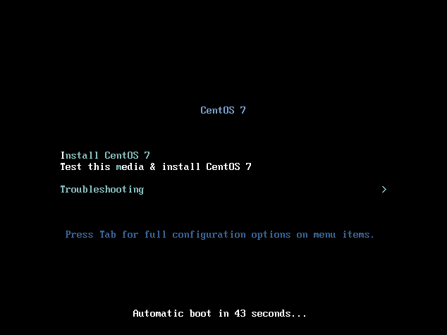
> 정상적으로 부팅이 된다면 아래와 같은 화면이 출력됩니다.  
키보드 방향 키를 사용하여 Install CentOS를 선택한 뒤 Enter 키를 누릅니다.

 
 
 
 

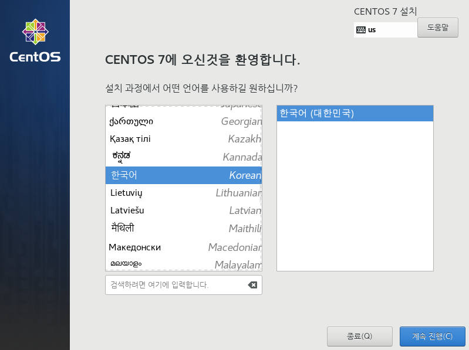
> 언어 설정은 한국어 또는 경우에 따라 원하는 언어로 지정합니다.

 
 
 
 

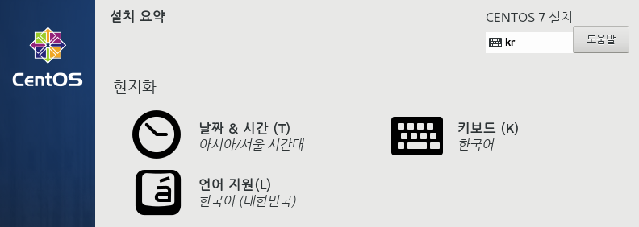
> 날짜 & 시간, 키보드, 언어 지원 이 세 가지 항목은 사용하는 현지에 따라 알맞게 설정합니다.

 
 
 
 

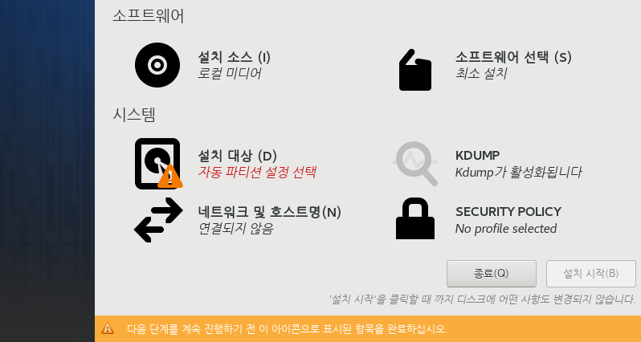
> 소프트웨어 선택을 클릭합니다.

 
 
 
 

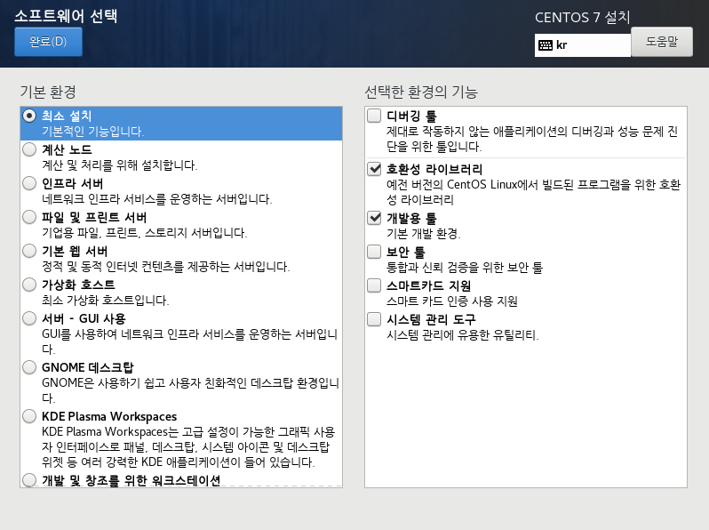
> 최소 설치 및 [세부옵션](https://www.tecmint.com/centos-7-5-installation-guide/)을 체크합니다. 해당 게시글은 최소 설치 옵션으로 설치를 진행함으로  
사용자의 목적에 따라서 설정을 변경 후 완료 버튼을 클릭합니다.  

 
 
 
 

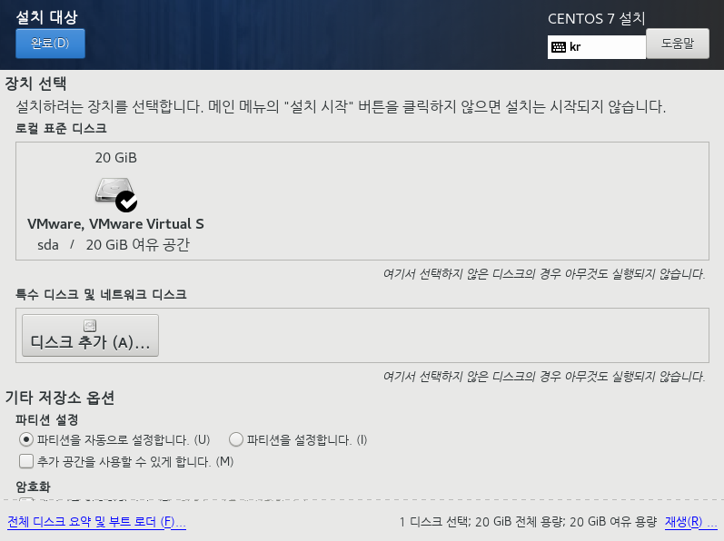
> 설치 대상을 클릭 하면 해당 화면으로 이동이 됩니다. OS 및 파티션 설정을 할 디스크를 선택한 뒤  
기타 저장소 옵션에서 자동으로 설정 또는 파티션 설정(수동)을 선택한 뒤 완료 버튼을 클릭합니다.  

 
 
 
 

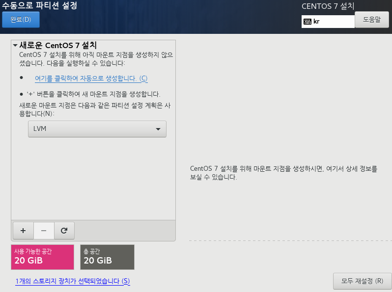
> 수동으로 파티션을 설정할 경우 파티션 설정을 선택한 뒤 완료 버튼을 클릭했다면 수동 설정하는  
화면으로 이동됩니다. 해당 화면에서 + 버튼을 클릭하여 파티션 옵션을 설정할 수 있습니다.   

 
 

**1. /boot : 부팅에 필요한 파일이 저장되는 파티션입니다.**  

 

**2. /boot/efi : UEFI / EFI 부팅을 사용할 때 필요한 파일이 저장되는 파티션입니다.**  
> 2-1. UEFI / EFI를 사용하지 않고 레거시 BIOS 방식을 사용하신다면 해당 파티션은 생성되지 않습니다.  

 

**3. / : root 디렉터리입니다. 리눅스의 시스템 파일, 사용자 파일, 서비스 등이 설치되는 파티션입니다.**  
> 3-1. 디스크 용량이 큰 경우 home 디렉터리를 분리한다던가 원하시는 데로 구성할 수 있습니다.  

 

**4. /swap : 리눅스의 가상 메모리입니다.**  
> 4-1. 리눅스에서 물리적 메모리(RAM)의 용량이 가득 차게 될 경우 사용되는 여유 공간입니다.  

 

**5. /home : 사용자의 홈 디렉터리입니다.**  

 
 
 
 

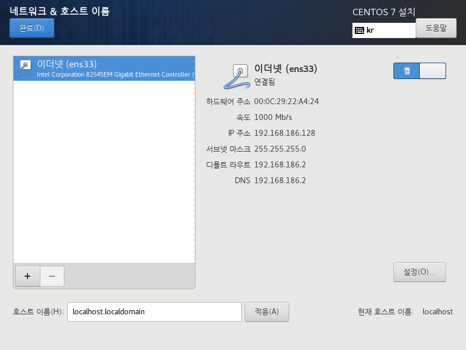
> 네트워크 & 호스트 설정을 클릭하시면 이더넷 설정을 하실 수 있습니다. 이더넷 설정을  
하지 않고 설치를 진행할 수 있으며 설치가 완료된 뒤에도 수동으로 이더넷을 설정할 수 있습니다.  

 
 
 
 

**만약 고정(범용) IP를 사용한다면 해당 창에서 설정 버튼을 클릭합니다.**

 
 
 
 

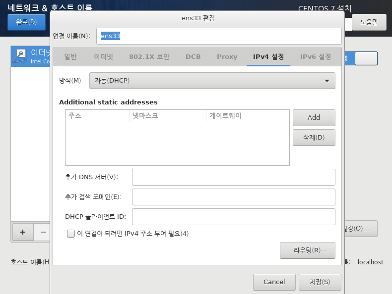
> 고정(범용) IP를 사용하기 위해서 설정 버튼을 클릭하면 해당 화면이 나옵니다.  
이 창에서 원하는 기재 사항 및 옵션을 설정한 뒤에 저장을 눌러줍니다.

 
 
 
 

### 설치 시작을 눌러줍니다.

 
 

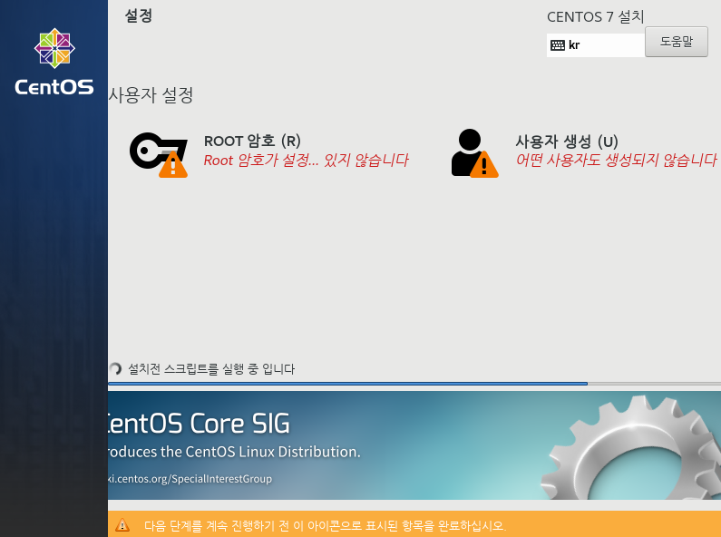
> 설치가 진행되는 동안 화면에서 root 암호 및 사용자를 생성할 수 있습니다.

 
 
 
 

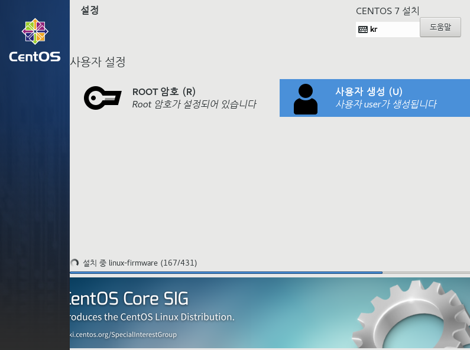
> 설정이 완료되면 느낌표가 사라집니다.

 
 
 
 

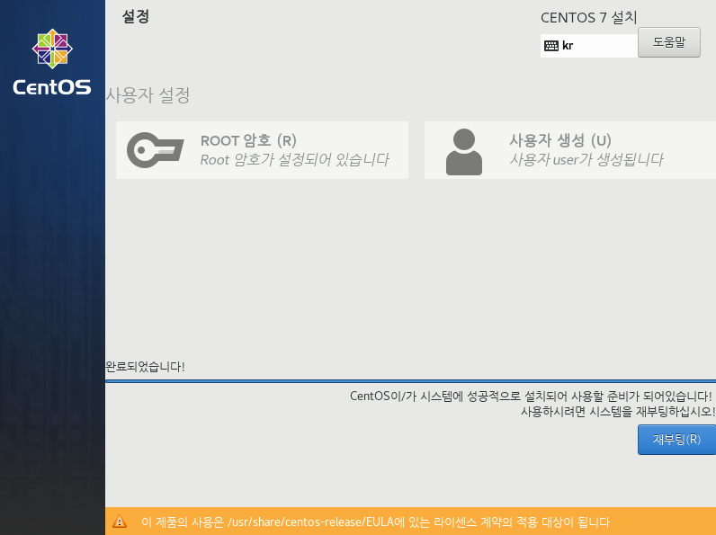
> 설치가 정상적으로 완료되면 재부팅 버튼을 클릭합니다.

 
 
 
 

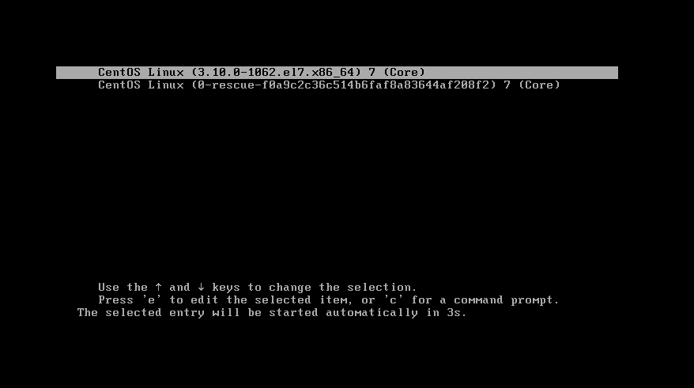
> 부팅 커널을 선택해 줍니다. (rescue 부팅은 복구모드 입니다.)

 
 
 
 

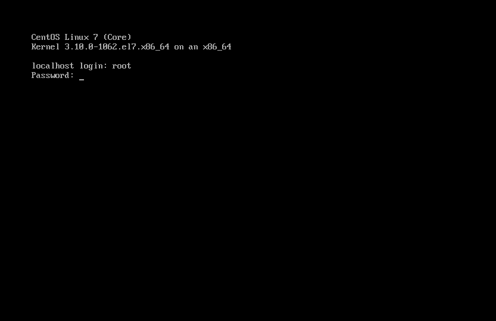
> 생성한 사용자 또는 root 로 로그인합니다.

 
 
 
 

# 이제 CentOS를 사용할 수 있습니다.

 
