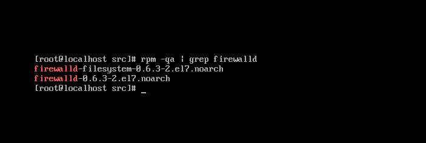
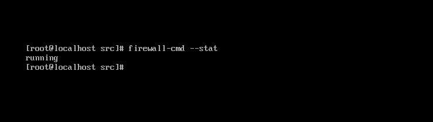

# firewall

<br/> 

#### CentOS 7 서버에 대한 [권장 사항](https://www.digitalocean.com/community/tutorials/additional-recommended-steps-for-new-centos-7-servers) 중 firewalld을 사용하여 방화벽을 구성하는 내용이 추가되어 있습니다.

> RHEL (Red Hat Enterprise Linux) 7 부터는 방화벽을 관리하는 [데몬](https://ko.wikipedia.org/wiki/%EB%8D%B0%EB%AA%AC_(%EC%BB%B4%ED%93%A8%ED%8C%85))이 firewalld로 변경되었습니다.  
자세한 내용은 [Red Hat Enterprise Linux 7 보안 가이드](https://access.redhat.com/documentation/en-us/red_hat_enterprise_linux/7/html/security_guide/sec-using_firewalls#Configuring_Complex_Firewall_Rules_with_the_Rich-Language_Syntax)
을 참조하십시오.

<br/> 

#### firewall 관련 가이드를 작성하기 위해서 해당 사이트를 참고 인용하였습니다.
- [firewalld 방화벽 사용](https://www.lesstif.com/pages/viewpage.action?pageId=43844015)
- [RHEL/CentOS 7 에서 방화벽(firewalld) 설정하기](https://www.lesstif.com/pages/viewpage.action?pageId=22053128#RHEL/CentOS7%EC%97%90%EC%84%9C%EB%B0%A9%ED%99%94%EB%B2%BD(firewalld)%EC%84%A4%EC%A0%95%ED%95%98%EA%B8%B0-zone)

<br/> 

> RHEL/CentOS 7 부터는 방화벽을 firewalld라는 데몬으로 교체하였고 이에 따라 사용자 레벨의  
프로그램은 iptables 명령어 대신 명령행에서는 firewall-cmd , GUI 환경에서는 firewall-config를 사용하게 되었습니다.  

<br/> 

#### firewall 이 이미 설치되어 있을 수 있습니다.
```
rpm -qa | grep firewalld
```

<br/> 

   
 

#### 만약 설치가 되어있지 않다면 yum 명령어를 통해 설치할 수 있습니다.
```
yum install firewalld
```


<br/> 


#### 정상적으로 설치되었다면 상태를 확인할 수 있습니다.
```
firewall-cmd --stat
```


<br/> 


   


<br/> 


#### firewall의 실행 및 중지는 systemctl 명령어를 사용합니다.
```
systemctl start firewalld  
systemctl stop firewalld  
```


<br/> 


firewall의 기본 설정 파일은 /usr/lib/firewalld/에 위치하고 있으며  
firewall의 동작은 /etc/firewalld/firewalld.conf에서 지정할 수 있습니다.


<br/> 


### Network Zone
> zone은 서버의 용도에 맞게 사전에 정의된 네트워크의 신뢰 레벨을 의미합니다.  


<br/> 


#### 1. firewall-cmd 명령어를 사용하여 zone, service, port 등을 컨트롤할 수 있습니다.  

<br/> 

- 새로운 zone을 생성할 수 있습니다.
```
firewall-cmd --permanent --new-zone=[zone.name]
```

<br/> 

- 생성한 존은 바로 반영되지 않으므로 firewall-cmd --reload 을 사용하여 방화벽 정책을 다시 읽어 들여야 합니다.
```
firewall-cmd --reload
```

<br/> 

- 생성된 zone을 삭제 수 있습니다.
```
firewall-cmd --permanent --delete-zone=webserver
```

<br/> 

- 사용할 수 있는 zone 을 볼 수 있습니다.
```
firewall-cmd --get-zones
```

<br/> 

- 현재 적용된 zone의 설정 사항을 전부 볼 수 있습니다.
```
firewall-cmd --list-all-zones
```

<br/> 

- 현재 활성화된 zone의 정보를 볼 수 있습니다.
```
firewall-cmd --get-active-zone
```

<br/> 

- 현재 zone에 추가된 서비스 목록을 볼 수 있습니다.
```
firewall-cmd --list-services
```

<br/> 

- 서비스를 추가할 수 있습니다.
```
firewall-cmd --permanent --zone=[zone.name] --add-service=[service.name]
```

<br/> 

- 서비스를 삭제할 수 있습니다.
```
firewall-cmd --permanent --zone=[zone.name] --add-service=[service.name]
```

<br/> 

#### 알림! firewall 은 기본적으로 22번 포트 SSH, dhcpv6-client는 기본으로 허용되어 있습니다.

<br/> 
<br/>

지정  zone에 포트를 추가할 수 있습니다.
```
firewall-cmd --permanent --zone=webserver --add-port=[port]/[tcp or udp]
```

<br/> 

지정 zone에 포트 범위를 추가할 수 있습니다.
```
firewall-cmd --permanent --zone=webserver --add-port=[startport-endport]/[tcp or udp]
```

<br/> 

지정  zone에 포트를 삭제할 수 있습니다.
```
firewall-cmd --permanent --zone=webserver --remove-port=[port]/[tcp or udp]
```

<br/> 
<br/> 

#### 2. Network Zone 설정 파일을 수정하여 컨트롤할 수 있습니다.
> Network Zone 및 포트 설정 파일은 /etc/firewalld/zones/ 하위에 위치하며  
[zone].xml 과(와) 같은 형식으로 생성하여 사용할 수 있습니다.  


##### Public.xml
```
<zone>
  <short>Public</short>
  <description>For use in public areas. You do not trust the other computers on networks
               to not harm your computer. Only selected incoming connections are accepted.</description>
  <service name="dhcpv6-client"></service>
  <service name="ssh"></service>
  <port protocol="tcp" port="8080"></port>
  <port protocol="tcp" port="22"></port>
</zone>
```

<br/> 

- firewall 설정 파일 (xml) 을 수정한 뒤에는 firewall-cmd --reload 을 사용하여 방화벽 정책을 다시 읽어 들여야 합니다.
```
firewall-cmd --reload
```


