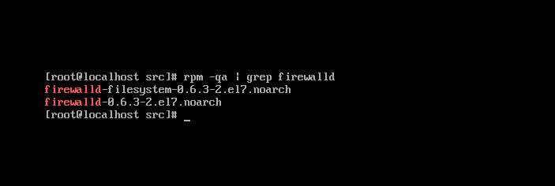
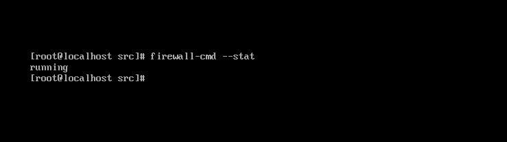

# Firewall

  

#### CentOS 7 서버에 대한 [권장 사항](https://www.digitalocean.com/community/tutorials/additional-recommended-steps-for-new-centos-7-servers) 중 firewalld을 사용하여 방화벽을 구성하는 내용이 추가되어 있습니다.

> RHEL (Red Hat Enterprise Linux) 7 부터는 방화벽을 관리하는 [데몬](https://ko.wikipedia.org/wiki/%EB%8D%B0%EB%AA%AC_(%EC%BB%B4%ED%93%A8%ED%8C%85))이 firewalld로 변경되었습니다.  
자세한 내용은 [Red Hat Enterprise Linux 7 보안 가이드](https://access.redhat.com/documentation/en-us/red_hat_enterprise_linux/7/html/security_guide/sec-using_firewalls#Configuring_Complex_Firewall_Rules_with_the_Rich-Language_Syntax)
을 참조하십시오.

  

#### Firewall 관련 가이드를 작성하기 위해서 해당 사이트를 참고 인용하였습니다.
- [firewalld 방화벽 사용](https://www.lesstif.com/pages/viewpage.action?pageId=43844015)
- [RHEL/CentOS 7 에서 방화벽(firewalld) 설정하기](https://www.lesstif.com/pages/viewpage.action?pageId=22053128#RHEL/CentOS7%EC%97%90%EC%84%9C%EB%B0%A9%ED%99%94%EB%B2%BD(firewalld)%EC%84%A4%EC%A0%95%ED%95%98%EA%B8%B0-zone)

  

> RHEL/CentOS 7 부터는 방화벽을 firewalld라는 데몬으로 교체하였고 이에 따라 사용자 레벨의  
프로그램은 iptables 명령어 대신 명령행에서는 firewall-cmd , GUI 환경에서는 firewall-config를 사용하게 되었습니다.  

  

#### Firewall 이 이미 설치되어 있을 수 있습니다.
> rpm -qa | grep firewalld 명령어를 사용하여 패키지를 검색합니다.  

  

   
 

#### 만약 설치가 되어있지 않다면 yum 명령어를 통해 설치할 수 있습니다.
> yum install firewalld  

  

#### 정상적으로 설치되었다면 상태를 확인할 수 있습니다.
> firewall-cmd --stat  

  

   

  

#### firewall의 실행 및 중지는 systemctl 명령어를 사용합니다.

